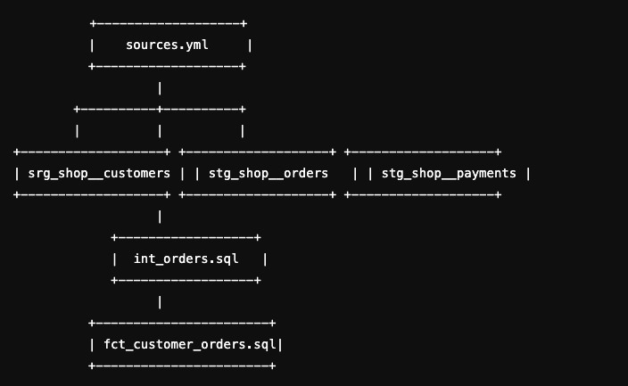

# DBT Refactoring Project: Customer Orders

This project involves refactoring a legacy SQL file (`customer_orders.sql`) that previously joined three tables: `customers`, `orders`, and `payments` in BigQuery. The refactor aims to optimize the data flow, clean up the code, and create a more understandable and maintainable structure.

## Folder Structure

- **staging**: Contains the stage files for individual tables and sources.

  - `sources.yml`: Defines the sources, including `customers`, `orders`, and `payments`.
  - `srg_shop__customers.sql`: SQL file for staging the `customers` table.
  - `stg_shop__orders.sql`: SQL file for staging the `orders` table.
  - `stg_shop__payments.sql`: SQL file for staging the `payments` table.

- **marts**: Contains the intermediate and final transformation files.

  - `int_orders.sql`: Joins the `orders` table with the `customers` table and performs necessary aggregations.
  - `fct_customer_orders.sql`: The final transformation file for `customer_orders`.

- **legacy**: Contains the original legacy SQL file for reference.
  - `customer_orders.sql`: The legacy SQL file before the refactor.

## Refactoring Overview

The primary goal of this refactoring was to:

1. Clean up the code for improved readability and maintainability.
2. Create a more understandable structure by separating stages for each table.
3. Optimize the data flow by restructuring and simplifying the transformations.

### Key Changes:

- The original code was split into more manageable and reusable components, with staging files to handle the raw data.
- A new file for intermediate transformations (`int_orders.sql`) was introduced, which aggregates and joins relevant data before the final transformation.
- The final transformation file (`fct_customer_orders.sql`) consolidates the data into a clean, structured fact table.
